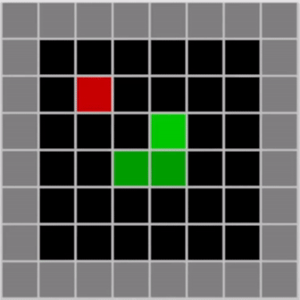

# Common Reinforcement Learning algorithms implemented on Snake

Common reinforcement learning algorithms are applied to the game Snake. Some of my favorite runs are displayed below.
<p style="width: 338px; margin: auto;">
    
    <figcaption style="text-align:center">Double DQN</figcaption>
</p>

## Code Structure

There are 4 main partitions of the projects which allow for using JSON files to essentially pick and choose different algorithms, models, exploration strategies, and board states within the code. I will outline the structure for each of these parts along with their encapsulation. I will also explain how to add additional algorithms, models, exploration strategies, and board states if interested.

<div align="center">

| Agent              | Description | Policy Type | Paper |
|--------------------|-------------|-------------|-------|
| DQN                |             | Off-Policy  |       |
| Double DQN         |             | Off-Policy  |       |
| Prioritized DDQN   |             | Off-Policy  |       |
| Dueling PDDQN      |             | Off-Policy  |       |
| MultiStep DPDDQN   |             | Off-Policy  |       |
| NoiseyNet          |             | Off-Policy  |       |
| Distributional DQN |             | Off-Policy  |       |
| RainbowDQN         |             | Off-Policy  |       |
| Actor2Critic       |             | On-Policy   |       |
| Actor3Critic       |             | On-Policy   |       |

</div>

### Models

Whenever a model is needed within the project the Model() class in model.py is called, which parses the JSON parameters of the model version passed in at runtime. When constructing the model appends blocks to a sequential model in PyTorch, which enables everything about an experiment to be encapsulated in the JSON file. For example, when creating a CNN model for a DQN, we will assign the topology of the network to the keyword `model`.

```JSON
"model":{
    "Conv2D":{
        "in_channels" : 4,
        "out_channels" : 32,
        "kernel_size" : [2,2],
        "stride" : 1
    },
    "ReLU" : {},
    "Conv2D_1":{
        "in_channels" : 32,
        "out_channels" : 32,
        "kernel_size" : [2,2],
        "stride" : 1
    },
    "ReLU_2" : {},
    "Flatten":{},
    "Dense":{
        "in_features" : 1152,
        "out_features" : 128
    },
    "ReLU_3" : {},
    "Dense2":{
        "in_features" : 128,
        "out_features" : 3
    }
}
```

Order is important in the JSON file and runtime errors will be thrown if the model parameters within the JSON file are not compatible with the `game_state` parameters within the JSON file.

It is also possible to customize the deuling architecture through the JSON file. An example of a deuling layer can be seen below. Here we create two splits named State and Action and then define each of the splits. Each split will be its own sequential layer. Currently the naming scheme for deuling only allows State/Action splits however I will be adding more customization in the future.

```JSON

"Deuling":{
    "State": {
        "Dense":{
            "in_features" : 1152,
            "out_features" : 128
        },
        "ReLU_3" : {},
        "Dense2":{
            "in_features" : 128,
            "out_features" : 1
        }
    },
    "Action" : {
        "Dense":{
            "in_features" : 1152,
            "out_features" : 128
        },
        "ReLU_3" : {},
        "Dense2":{
            "in_features" : 128,
            "out_features" : 3
        }
    }
}

```


## Loading Pre-Trained Models


## How to run experiments

To run an expirement one simply needs to create a new model configuration and then pass it main.py. Ensure that you follow the scheme outlined below when defining an expiriment.

```BASH
(conda) snake@rl: python main.py model_v1
```

### JSON Parameters

## Personal Experiments

While training most of the models I set up a loger to track information about each of the runs so that I could later compare each run. I go over the things which I found interesting below.

## How to add on to this repository

I purposely made this repository as customizable as I could. I want it to be easy to add new features and test them out, wether thats a different exploration strategy, learning function, optimizer, model, or agent. It is very easy to add new ideas to this reposity and often requires just creating a new class to implement the functionality. For example when adding a new exploration strategy like Boltzmann all I had to do was create a new class called Boltzmann in exploration.py. I could then add onto the function determine_exploration with the naming scheme. After that this new exploration strategy can be called with all previous models.

```python

def determine_exploration(exploration_strategy):
    '''
    Parses the JSON dictionary passed to determnine which strategy to return as
    a callable object. In order to add new exploration/exploitation strategies
    simply just create a class with a get_action() and state_dict() function
    and then add its name to the following if/elif block.
    '''

    if exploration_strategy is None:
        strategy = Zero()
    elif exploration_strategy['name'] == 'epsilon-greedy':
        strategy = EpsilonGreedy(exploration_strategy)
    elif exploration_strategy['name'] == 'boltzmann':
        strategy = Boltzmann(exploration_strategy)
    else:
        raise Exception('Unknown exploration passed. Check naming convention.')

    return strategy

```

There are certain limiations of course such as complex algorithms which make it more difficult to drag and drop differents ideas into a model. For example prioritized replay experience needs to alter the training function and thus it needs to be its own agent rather than a drag and drop buffer type. However implementaion of agent is where you really understand how these things work and where I found the most enjoyment in this project.


## Acknowledgments

I would like to acknowledge [this repository](https://github.com/patrickloeber/snake-ai-pytorch) which I originally used to get started with reinforcement learning. The basic structure of the snake game was lifted from the repository, however many things were changed in order to improve the display of the game and also to expand the context window to the entire board frame, plus additional board frames. Furthermore, the structure of this codebase was heavily inspired by [this repository](https://github.com/DragonWarrior15/snake-rl), where JSON files were parsed in order to control the model parameters. I do want to note that 98% of this code was still written by me and inspiration was just lifted from these sources.

### Important Papers used for this Project
